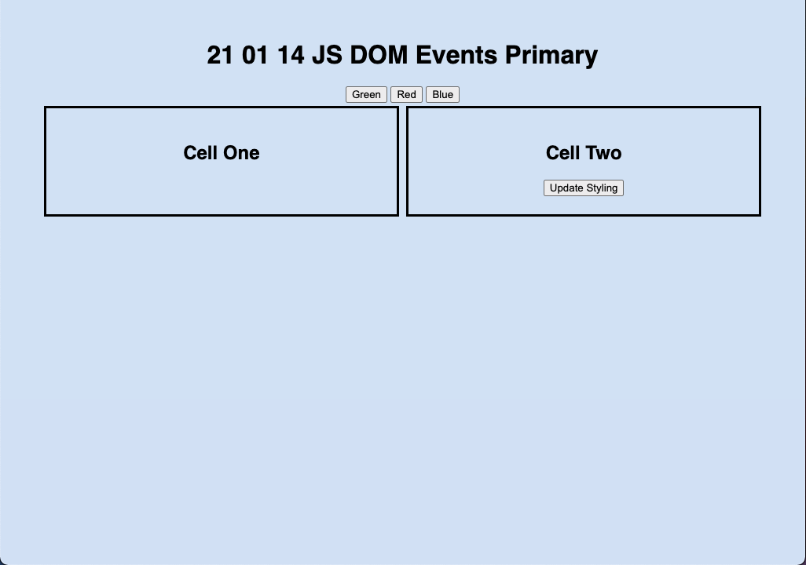

# 21 01 14 JS DOM Events Primary

## Set Up
Add comments throughout the JavaScript file (at minimum). Comment out any broken code before 9PM submission and provide context on what's not working. Link your stylesheet in the head using the link tag. Link the JS file at hte bottom of the body tag using the script tag. Ensure that the files are linked and push before starting on any requirements.

Requirements

HTML + CSS
1. Chose a background color for your page and pull all content away from the window similarly to the wireframes using margin
1. Display the assignment title as a centered heading at top the page
1. Display three buttons similarly to the wireframes
1. Add an on click event handler to each button
1. Display an element to the left with the heading "Cell One"
1. Display another element to the right with the heading "Cell Two" and a button
1. Use grid display and grid template columns to position the elements
1. Give each element in the grid a black border similarly to the wireframes

JS

1. Select each grid element and the button in the second grid element
1. Define each of the functions called by the button event handlers
    - Each function should change the background color of both grid elements to the color indicated on the button
1. Add an event listener to the first grid element that changes the text to "You Entered This Cell" when you mouse over the element.
    - Update the innerHTML of the element in order to keep the text as a heading instead of plain text
1. Add an event listener to the button in the second grid element that applies a class that sets the text color to white; this function should also remove the class if it is applied before the button is clicked

